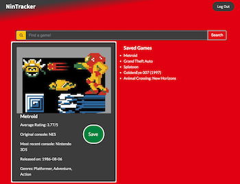

# NinTracker

  ## Description
An app that allows the user to create an account, then search a desired game title or genre, then receive a detailed description and image of gameplay in a novel handheld game console display. Users can save favorite games to a "Saved Games" list for future reference.

  URL: https://boiling-plains-43100.herokuapp.com/
  
  ## Table of Contents

  <a href='#Tools Used'>Installation</a>

  <a href='#How to use'>How to use</a>
  
  <a href='#API Reference'>API Reference</a>
  
  <a href='#Contribution'>Contribution</a>

  <a href='#Credits'>Credits</a>

  <a href='#Questions'>Questions</a>

  
  Screenshot of NinTracker's main page
 

  ## <a id='Tools Used' style='color:white;'>Tools Used</a>
  The following tools were used in development: Express.js, MySQL2, Sequelize, bcrypt.js, Express-session, Passport.js, Passport-local

  ## <a id='How to use' style='color:white;'>How to use</a>
  Login or create an account to begin. Once on main page, enter a game title, genre, or release year to receive a result displayed in the handheld game console display. Display includes the first console the game was one, the most recent console, release year, and genre. Press the 'Save' button to add the title to your 'Saved Games' list. Reference the list later to reference which games you'd like to play.
  
  ## <a id='API Reference' style='color:white;'>API Reference</a>
RAWG API - https://rawg.io/apidocs

  ## <a id='Contribution' style='color:white;'>Contribution</a>
  Fork the repo and submit potential changes for future development.
  
  ## <a id='Credits' style='color:white;'>Credits</a>
Contributors

Andrew Smith - https://github.com/AndrewCodesDontYaKnow

Ryan Baird - https://github.com/Rjbaird

  
  ## <a id='Questions' style='color:white;'>Questions</a>
  Contact Andrew Smith with questions at andrewsmith593@gmail.com.

  GitHub Username: AndrewCodesDontYaKnow

  Github Profile: <a href='https://github.com/andrewcodesdontyaknow'>https://github.com/andrewcodesdontyaknow</a>
  
  

  <!-- Email: andrewsmith593@gmail.com -->

